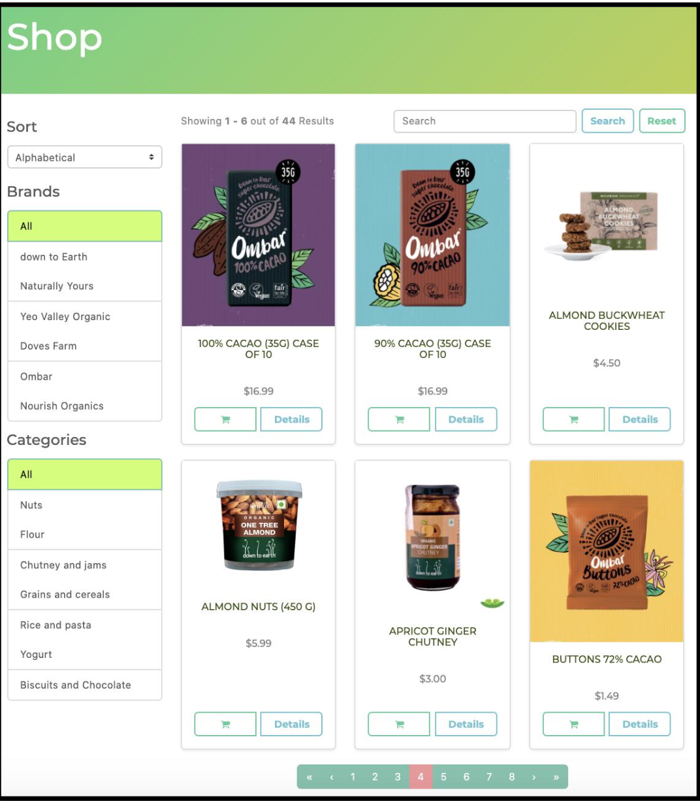
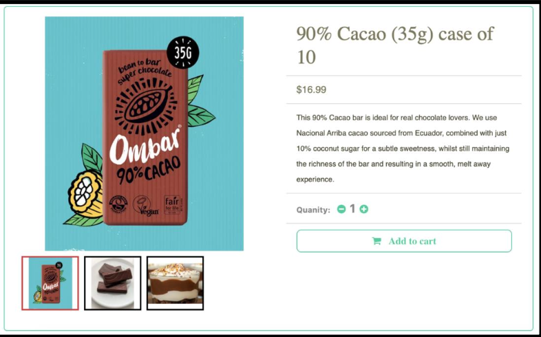
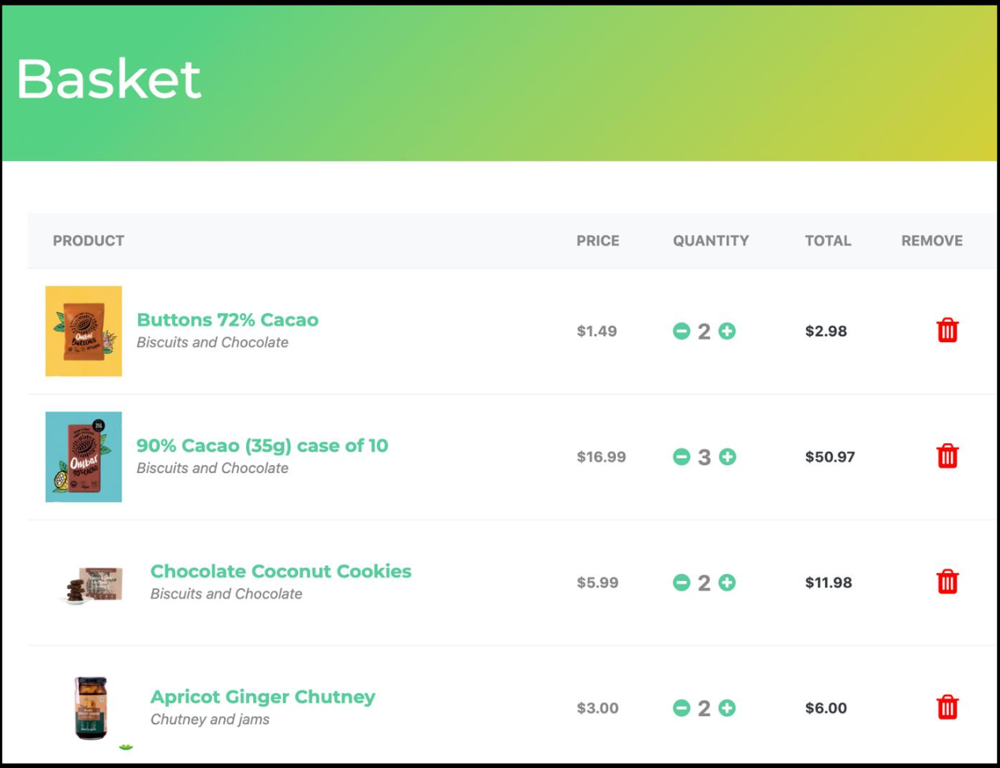
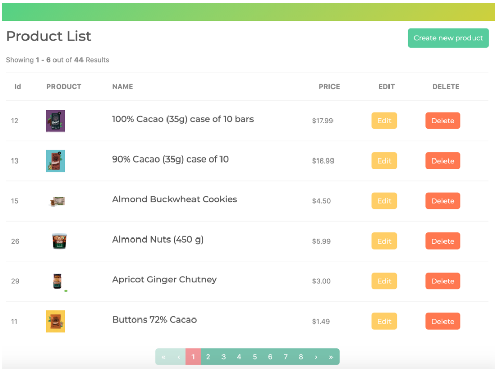

# 🌱 Organic Food E-Commerce Website

A full-featured e-commerce web application for an imaginary organic food store, developed as a senior thesis project by Radostina Kisleva at the American University in Bulgaria.

## 📋 Project Overview

This project is a user-friendly e-commerce website that allows customers to browse organic products, manage shopping carts, and place secure orders. It also includes a full admin panel for inventory management.

The project was developed with a clean architecture approach, separating the backend and frontend for modularity and scalability.

---

## 🛠️ Technologies Used

### 🔙 Backend
- **ASP.NET Core** (.NET 5)
- **C#**
- **Entity Framework Core**
- **SQLite** (database)
- **Redis** (shopping cart persistence)

### 🔝 Frontend
- **Angular**
- **TypeScript**
- **HTML / SCSS / Bootstrap**
- **Font Awesome**

### 🔧 Tools
- **Visual Studio Code**
- **Postman**

---

## ✨ Features

### 👤 User Features
- Register / Login
- Browse products with:
  - Category and brand filters
  - Name and price sorting
  - Search bar
- View product details with image gallery
- Add/edit/remove items in a persistent shopping cart
- Checkout with address, shipping, and payment steps
- View order history and details

### 🔐 Admin Features
- Secure admin login with role-based access
- Add/edit/delete products
- Upload/manage product images
- Real-time product list updates

---

## 📦 Architecture

Follows **Clean/Onion Architecture**:

```
Client (Angular) → API Layer (.NET) → Application Core → Data Access (EF Core)
```

- **Frontend**: SPA powered by Angular
- **Backend**: RESTful APIs built with .NET Core
- **Database**: SQLite for persistent storage
- **State Management**: Redis for in-memory cart handling

---

## 🧪 Testing

- Manual acceptance testing with multiple user flows
- Error handling and validation on both frontend and backend
- Secure authentication and authorization with JWT tokens

---

## 🚀 Getting Started

### Prerequisites
- .NET 5 SDK
- Node.js & npm
- Redis (for cart storage)

### Setup

1. **Backend**
   ```bash
   cd backend
   dotnet restore
   dotnet ef database update
   dotnet run
   ```

2. **Frontend**
   ```bash
   cd frontend
   npm install
   npm start
   ```

Visit `http://localhost:4200` to use the app.

---

## 📸 Screenshots

### The application’s “Shop" page with no filters applied



### Product Details Page for a chocolate bar



### Shopping basket View



### Admin Panel Overview



---

## 📌 Future Improvements

- Integration with a real payment processor (e.g., Stripe)
- Product reviews and ratings
- Email notifications for orders
- Responsive mobile layout enhancements

---

## 👩‍💻 Author

**Radostina Kisleva**
Computer Science Department, AUBG
Supervisor: John Galletly
Date: April 6, 2021

---

## 📄 License

This project is for academic purposes. Contact the author for reuse or extension.